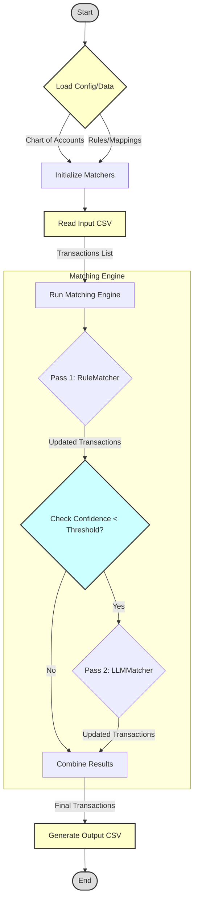
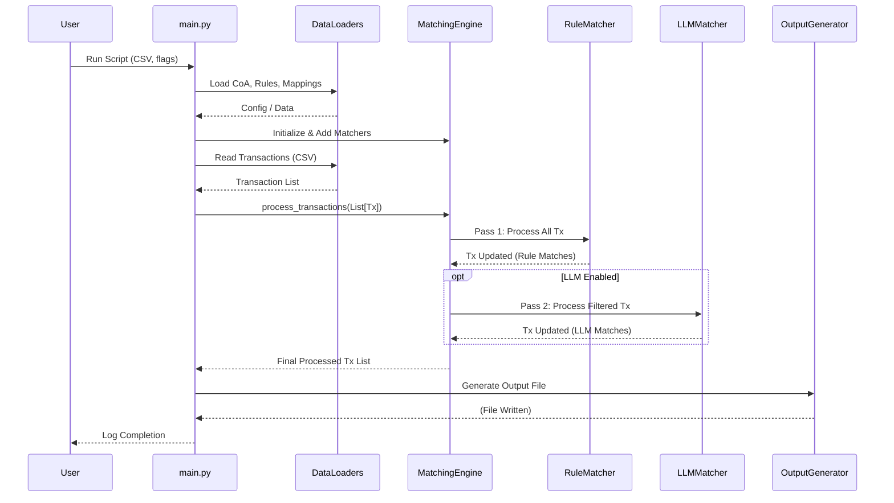
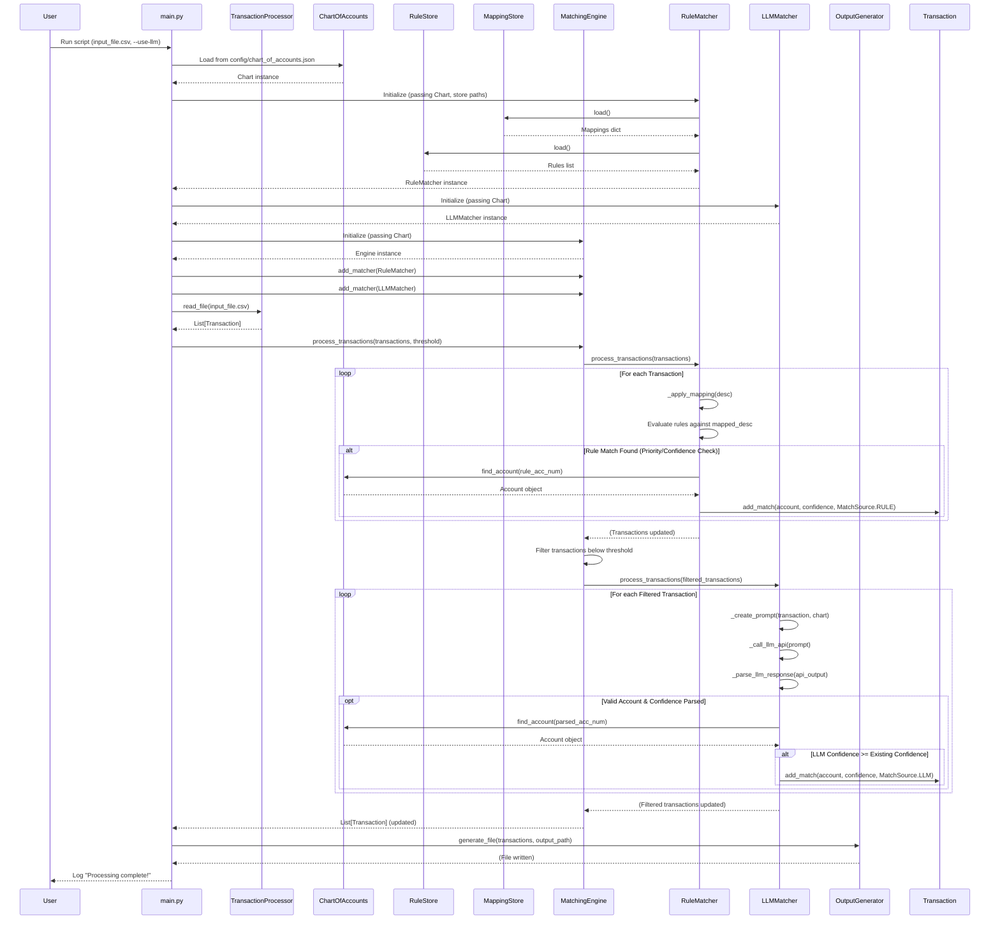

# TXL Accounting Demo

A transaction matching system that helps accountants match bank transactions to the appropriate accounts in a chart of accounts using rule-based matching.

## Overview

TXL Accounting Demo is designed to automate the process of matching bank transactions to the appropriate accounts in a chart of accounts. It uses a combination of rule-based matching and confidence scoring to suggest the most likely account for each transaction, reducing manual work for accountants.

## Features

- Import transactions from CSV or Excel files
- Match transactions to accounts using customizable rules
- Calculate confidence scores for matches
- Export matched transactions to CSV or Excel
- Comprehensive test suite for all components

## Project Structure

```
TXL_Accounting_Demo/
├── src/                      # Source code
│   ├── data/                 # Data processing
│   │   ├── input_processor.py  # Handles file input
│   │   └── output_generator.py # Handles file output
│   ├── matching/             # Matching algorithms
│   │   ├── matcher.py        # Base matcher class
│   │   └── rule_matcher.py   # Rule-based matcher
│   ├── models/               # Data models
│   │   ├── account.py        # Account and ChartOfAccounts
│   │   └── transaction.py    # Transaction model
│   └── utils/                # Utility functions
├── tests/                    # Test suite
│   ├── data/                 # Tests for data processing
│   ├── matching/             # Tests for matching algorithms
│   └── models/               # Tests for data models
├── .gitignore                # Git ignore file
├── BUILD_PLAN.md             # Development plan
├── README.md                 # This file
└── requirements.txt          # Project dependencies
```

## Program Flow

1. **Data Import**
   - User provides a CSV or Excel file containing transactions
   - `InputProcessor` reads and validates the data
   - Transactions are converted to `Transaction` objects

2. **Chart of Accounts**
   - The system loads a chart of accounts
   - Accounts are organized in a hierarchical structure
   - Each account has a number, name, and optional parent account

3. **Transaction Matching**
   - For each transaction, the `MatchingEngine` orchestrates the process:
     - **Pass 1 (Primary Matcher - typically `RuleMatcher`):**
       - Applies description mappings (e.g., `"Vendor LLC" -> "Vendor"`).
       - Evaluates predefined rules against the mapped description.
       - Selects the best rule match based on priority and confidence.
       - Updates the `Transaction` with the match (account, confidence, source=RULE).
     - **Pass 2 (Secondary Matcher - typically `LLMMatcher`, if enabled):**
       - Filters transactions that were not matched in Pass 1 or had confidence below a threshold.
       - For each filtered transaction:
         - Creates a prompt including transaction details and Chart of Accounts context.
         - Calls the LLM API.
         - Parses the response (account number and confidence score).
         - If the LLM match is valid and has confidence >= any existing match, updates the `Transaction` (account, confidence, source=LLM).

4. **Output Generation**
   - Matched transactions are exported to CSV or Excel using `OutputGenerator`.
   - Output includes transaction details and match information (Account Number, Name, Path, Confidence, Source).
   - Alternative matches (from `Transaction.add_match` logic) may also be included.

### Flowchart

This diagram shows the overall process flow.



### High-Level Sequence Diagram

This diagram shows the main interaction between components.



### Detailed Sequence Diagram (with LLM enabled)

This diagram provides more detail on the internal calls.



## Getting Started

### Prerequisites

- Python 3.8 or higher
- pip (Python package manager)

### Installation

1. Clone the repository:
   ```
   git clone https://github.com/yourusername/TXL_Accounting_Demo.git
   cd TXL_Accounting_Demo
   ```

2. Create a virtual environment:
   ```
   python -m venv venv
   source venv/bin/activate  # On Windows: venv\Scripts\activate
   ```

3. Install dependencies:
   ```
   pip install -r requirements.txt
   ```

### Usage

The command-line interface is currently under development. Once completed, you'll be able to:

1. Import transactions:
   ```
   python -m src.cli import --file transactions.csv
   ```

2. Match transactions:
   ```
   python -m src.cli match --chart chart_of_accounts.json
   ```

3. Export results:
   ```
   python -m src.cli export --output matched_transactions.xlsx
   ```

## Development

### Running Tests

```
python -m pytest tests/
```

### Adding New Features

1. Create a new branch for your feature
2. Implement the feature
3. Write tests for the feature
4. Submit a pull request

## License

This project is licensed under the MIT License - see the LICENSE file for details.

## Acknowledgments

- Thanks to all contributors who have helped with this project
- Inspired by real-world accounting challenges 